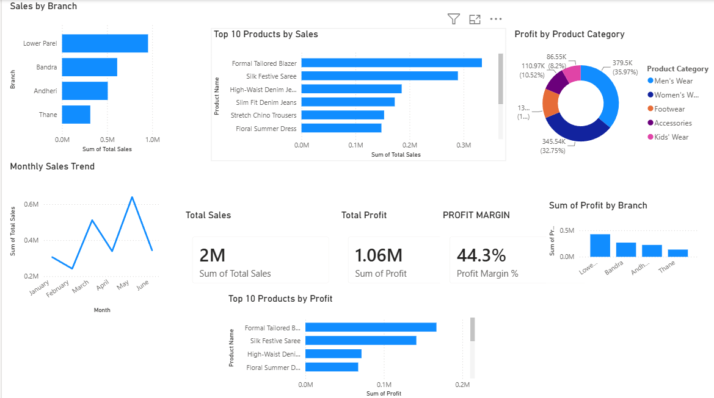

# Retail Sales Performance Dashboard — Power BI

An interactive Power BI dashboard analyzing sales, profit, and performance 
across a multi-branch retail business.

## Features
- KPI cards: Total Sales, Total Profit, Profit Margin %
- Sales by Branch (bar chart)
- Monthly Sales Trend (line chart)
- Top 10 Products by Sales & by Profit
- Profit by Product Category (donut chart)
- Branch-wise profit comparison

## Dataset
500 rows of synthetic retail sales data across 4 Mumbai branches, 
spanning 6 months (Jan–Jun 2026).

## Tools
Power BI Desktop, DAX

## Screenshot

